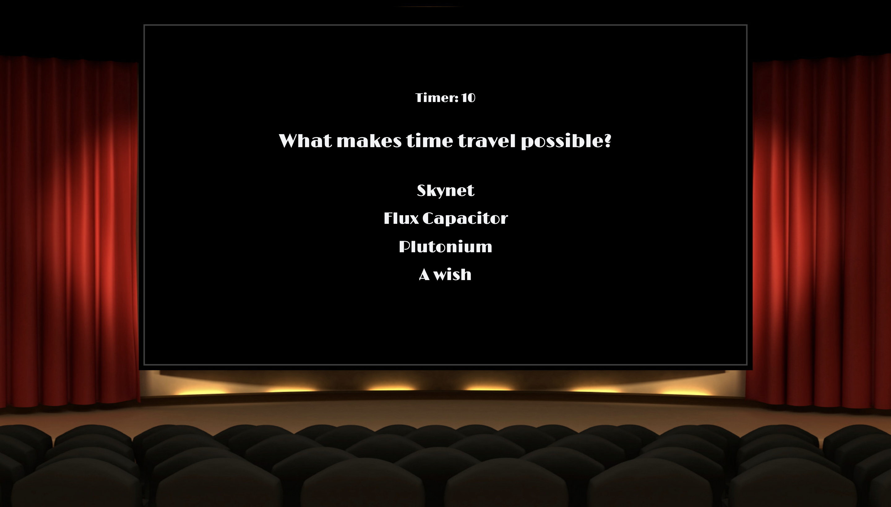
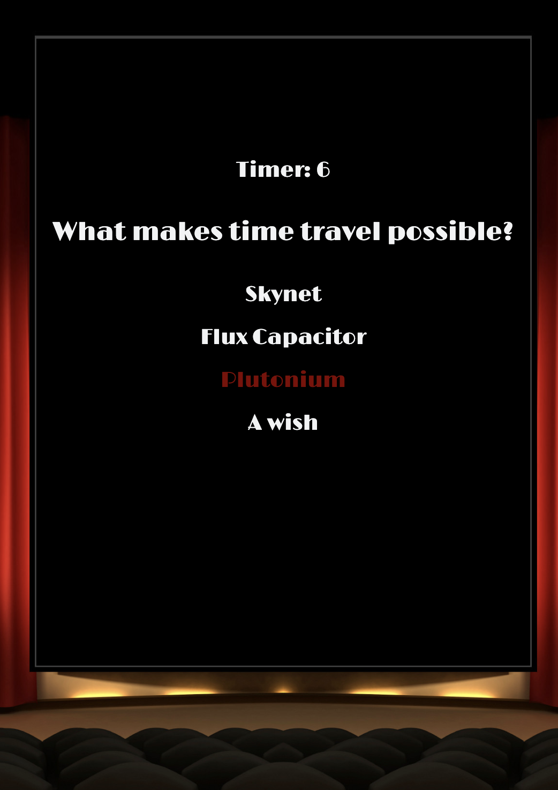

# Trivia Game

## Description

This is a triva game written in JavaScript and jQuery. After start, each of the 10 question have 15 seconds to be answered. After each question the correct answer is displayed before moving on to the next question. At the end of the game it tells you how many questions you answered correctly out of 10.

### Desktop view

### Mobile view

